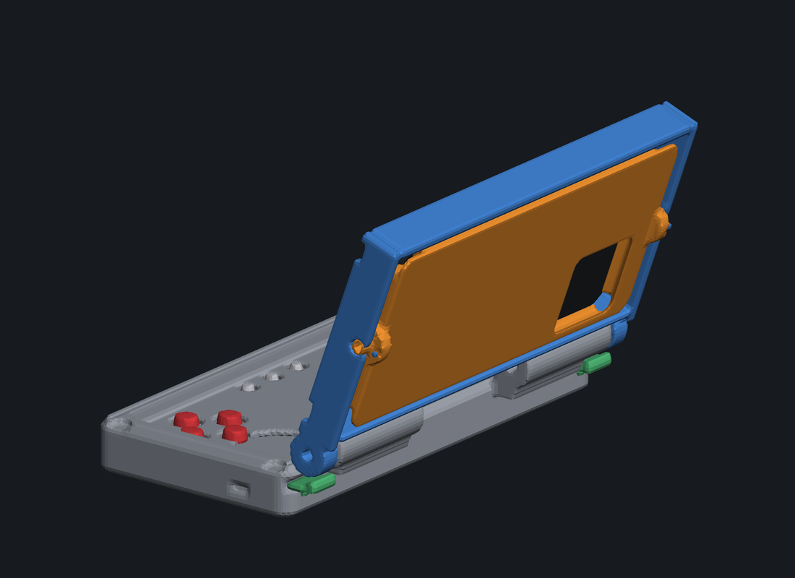

# flipdeck —— 让手机变掌机的翻盖手柄壳（可翻转托盘）

```
翻开 = 3DS 形态：手机当上屏，下面是实体摇杆 + 按键
合上 = 普通手机：托盘翻 180°，手机屏幕朝上，按键被盖住
```



[](LICENSE)
[](LICENSE)
[](https://li-mingshuang.github.io/flipdeck/)

**👉 [在线 3D 交互演示](https://li-mingshuang.github.io/flipdeck/)** —— 拖动看三种形态、拉滑块看托盘翻转、**还能直接用键盘玩手机屏幕上那个小游戏**（按哪个键，3D 模型上对应的键帽就按下去、摇杆就跟着摆）。

---

## 这是什么

一个**参数化 3D 结构方案**：给 iPhone 12（以及所有 ≤157×71.5mm 的 6.1"~6.3" 非 Max 机型）做的翻盖手柄壳。核心是一个**双平行轴机构**：

| 轴 | 位置 | 作用 |
|---|---|---|
| 合盖轴 θ | 后缘 | 翻开 / 合上，110° 是游戏角 |
| 托盘翻转轴 φ | 盖框内中线（沿 X） | 把手机连托盘翻 180°，屏幕从朝内变朝外 |

三种形态，一个动作切换：

| 形态 | θ / φ | 效果 |
|---|---|---|
| 展开游戏 | 110° / 0° | 手机当上屏（屏幕朝玩家），底座是摇杆 + 按键 |
| 合盖收纳 | 0° / 0° | 手机屏朝内被盖包住，按键也朝内，全保护 |
| 手机模式 | 0° / 180° | 手机屏朝上露出，按键被盖盖住，直接当普通手机用 |

## 三个关键设计（也是这个形态能成立的原因）

1. **托盘轴放在托盘板的中面上** → 翻转 180° 后托盘仍占同一层空间，只有手机从盖内侧换到盖外侧。否则要么盖变厚，要么合盖时手机撞底座。
2. **铰链凸耳全部走左右两侧**（`|x| ∈ [80, 88.5]`）→ 托盘/手机翻转时扫出半径 37.9mm 的圆，盖的中间区域不能有任何腹板。（第一版腹板在中间，直接被扫掠圆撞掉，是靠数值检查抓出来的。）
3. **控制件全部沉进井里** → 合盖时手机屏幕的平面就是底座顶面，所以摇杆要沉进口袋、键帽要嵌进孔里（现在净空 3.5mm）。

## 已验证的东西（不是嘴上说说）

所有几何都是 SDF 参数化建模 + 数值验证，`python build.py` 一键复现：

| 检查 | 结果 |
|---|---|
| 9 个打印件网格 | **全部水密**（边界边 0、非流形边 0），直接可切片 |
| 13 项装配姿态间隙 | **全部无干涉** |
| 托盘翻转全程扫描（φ 0→180 每 10°） | 最坏 **+0.15mm**（就是 Ø6 轴颈在 Ø6.3 轴承孔里的设计间隙） |
| 合盖游戏位：手机屏幕 ↔ 最高控制件 | **+3.5mm** 净空 |
| 合盖手机模式：deck ↔ 手机 | **+8.0mm** |
| 关键尺寸 | 合盖 179×88×36mm；手机模式厚 44.3mm；展开高 115mm |

<details>
<summary>过程中修掉的真问题（点开看）</summary>

- 间隙检测公式用 `min(dA+dB)` 会**假阳性** → 改用 `min max(dA, dB)`
- 托盘位姿写成 `R·p + pivot` 会让托盘整体平移 51mm，导致 φ=180° 的所有检查数字全是假的
- 密封条槽外缘与外壳上收边在圆角处相交 → 会切出 0.3mm 薄片（已改成同心内缩，并写进断言）
- 体素网格化时零件平面正好落在采样平面上会产生歧义单元 → 非流形边；加"自动搜索采样相位"后 9 件全水密
- 画 PCB 时发现 ABXY 上排 / 十字键上臂的开关焊盘压进摇杆口袋的孔里 → 按键簇前移 3mm

</details>

## 快速开始（做一台能玩的原型）

| 步 | 做什么 | 花费 |
|---|---|---|
| 1 | **打印**：先只打 `cradle.stl`（首件验手机），再打 `deck` + `lid` | ¥30–60 起（代打） |
| 2 | **买件**：ESP32-S3 SuperMini + 2×摇杆模块 + 11 个 6×6×2.0 贴片开关 + 五金 | ~¥80–140 |
| 3 | **刷固件**：`firmware/flipdeck_gamepad/flipdeck_gamepad.ino`（Arduino IDE，改引脚即可） | ¥0 |
| 4 | 焊线 → 装壳 → 手机蓝牙配对 `flipdeck` → 开玩 | ¥0 |

- 打印下单话术 + 首件检查单：**[ORDER_KIT.md](ORDER_KIT.md)**（可直接复制给代打）
- 采购清单 / 引脚表 / 接线 / 固件说明：**[ELECTRONICS.md](ELECTRONICS.md)**、**[firmware/README.md](firmware/README.md)**
- 打印参数 / 装配顺序 / 分期计划 / 风险：**[DIY_GUIDE.md](DIY_GUIDE.md)**
- 进度、决策记录、升级待办：**[PROGRESS.md](PROGRESS.md)**

> **不需要画 PCB**：摇杆直接拧进底座（口袋里有 Ø28 分布圆的 M2 自攻孔），主控拧在底座的 PCB 柱上，11 个开关用打印的开关架定位（`switch_frame.stl`）。

## 在线 3D 演示

- 线上：<https://li-mingshuang.github.io/flipdeck/>（GitHub Pages，源 = `docs/`）
- 本地：

```bash
python -m http.server 8010
# 浏览器打开 http://127.0.0.1:8010/web/flipdeck_viewer.html
```

演示页是**零依赖**的（自己写的 WebGL 渲染器，不用 CDN）：拖滑块改 θ/φ、一键三形态、播放翻转动画、隐藏手机看内部、换屏幕内容（可玩的游戏 / 主屏幕 / 你自己的图 / 灭屏）、CRT 扫描线滤镜；**键盘就能玩屏幕里的游戏**，同时 3D 模型上的键帽会按下去、摇杆会摆（鼠标也能直接拖摇杆帽）。
页面里的机构矩阵用 `web/verify_matrix.js` 与 Python 的 `poses.pose` 对过答案，四个姿态偏差 ≤0.0005mm。

## 仓库结构

```
flipdeck-cad/
├─ flipdeck/            内核：params(参数) sdf(SDF内核) parts(零件) poses(位姿+间隙检查)
│                       meshlib(SDF→水密网格/STL) render(纯 numpy 软件渲染器)
├─ firmware/            ESP32-S3 BLE 手柄固件 + 烧录/标定说明
├─ web/                 交互式 3D 演示（WebGL，零依赖）+ 轻量 STL
├─ docs/                GitHub Pages（= web 的打包产物，由 make_docs.py 生成）
├─ out/stl/             **9 个打印件 STL**（全部水密）
├─ out/ip12/            iPhone 12 版渲染图（含 contact_sheet 总览拼图）
├─ out/pcb/             PCB 板框（DXF/SVG/PNG）+ 板级自检报告
├─ build.py             SDF→网格→STL + 渲染 + 报告（一键复现）
├─ check_poses.py       装配干涉检查
├─ pcb_outline.py       板框生成 + 板级自检
├─ web_export.py        导出网页用轻量 STL
├─ make_docs.py         生成 docs/（Pages）
├─ status.py            刷新 PROGRESS.md 的状态块
└─ ORDER_KIT.md / DIY_GUIDE.md / ELECTRONICS.md / PROGRESS.md / README.md
```

一键复现：`python build.py --render-dir ip12`（STL + 渲染 + 报告，约 6 分钟）。

## 换机型

`deck` 和 `lid` 的几何**完全不引用手机参数** —— 换手机只换托盘这一个件。托盘外廓 160×74.5 是"接口标准"，可装上限 **157 × 71.5mm**（6.1"~6.3" 非 Max 机型通用）；Pro Max / Plus 那档（77.6~78.1mm 宽）需要放大托盘并连锁放大盖框和底座。改 `flipdeck/params.py` 里的 `PHONES` 表 + `DEFAULT_PHONE`，然后 `python build.py` 即可，`sanity()` 会重新断言所有余量。

## 已知取舍

- **合盖手机模式相机会被盖挡住**（后摄贴着托盘板），要合盖拍照需要托盘轴偏心 + 开相机通孔
- **没有硬限位**：0°/110°/180° 靠凸点 + 摩擦自锁，防不住暴力过转
- **合盖 44mm 厚**：这是"合盖还要能当手机用"的物理代价；想瘦身只能把 deck 做成磁吸可拆模块
- 手机固定靠托盘挡墙 + 沉台（正常使用不会掉），倒甩/装兜需要再加磁铁或 TPU 卡爪

## 许可证

- 代码（Python / 固件 / 网页）：**MIT**
- 硬件设计文件（STL、Pages 页面、生成的几何）：**CC BY 4.0**，署名注明 `flipdeck` 及本仓库链接

详见 [LICENSE](LICENSE)。
